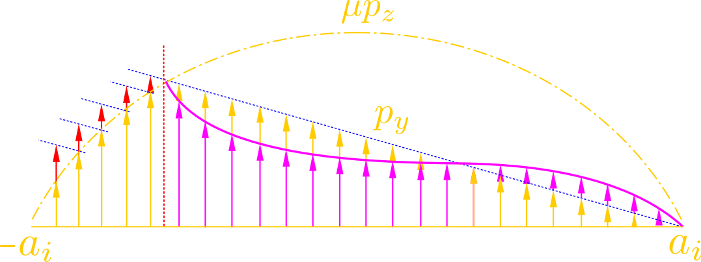
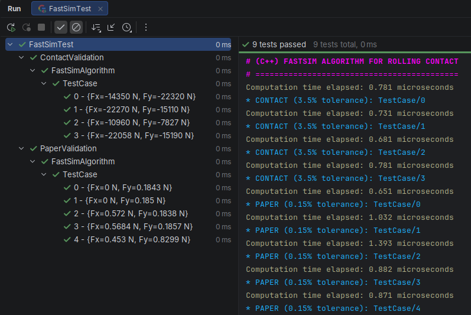
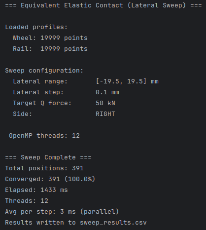

[![LinkedIn][linkedin-shield]][linkedin-url]

<!-- PROJECT LOGO -->

  
  <h3 align="center">Railway applications &#x300A; C &#x300B;</h3>
  

    <b>C++ Wheel-Rail Contact Libraries </b>
  

  

    Normal Contact Solver, FastSim Algorithm & Kalker's Book of Tables (TABCON)
  

## About the project

  

> Modern `C++` suite for wheel-rail rolling contact dynamics and contact mechanics simulation. This repository brings together high-performance implementations of classic and state-of-the-art contact algorithms—covering both the **normal contact problem** (contact patch geometry and normal pressure) and the **tangential contact problem** (creep forces, spin moments, and linear creepage coefficients).

`Why this repo?:`

- In order to provide robust, modern C++ implementations of essential railway contact algorithms that, despite being industry and academic standards, are rarely available as modular, open-source C++ libraries.

- To provide a unified pipeline where the normal contact solver directly feeds geometric and load parameters into tangential creep-force solvers ([FastSim](./tang_fastsim) and [TABCON](./tang_spin_tabcon)).
  
  

       

    :muscle: don't let anyone get you down :muscle:
  
 
  

---

## Suite Modules & Architecture

The suite consists of three complementary subprojects:

### 1. [`tang_fastsim`](./tang_fastsim) — FastSim Tangential Contact Algorithm

> A modern C++ implementation of Kalker's classic FASTSIM algorithm, designed for calculating tangential creep forces under rolling contact based on the simplified theory.

- **Key Capabilities:**
  - Fast computation of longitudinal ($F_x$) and lateral ($F_y$) tangential contact forces.
  - Strips-based integration across the elliptical contact patch under a parabolic normal pressure distribution.
  - Supports non-dimensional creepages ($\xi, \eta$) and spin ($\phi$).
  - Adaptive and uniform strip discretization with convergence controls.
- **Reference:**
  - **Original Source:** Fortran implementation by J. J. Kalker [[1](#ref-1)].

### 2. [`normal_eq_elastic`](./normal_eq_elastic) — Normal Contact Problem (Equivalent Elastic Method)

> C++ port and optimization of the equivalent elastic contact method for solving the non-Hertzian normal contact problem between arbitrary wheel and rail profiles.

- **Key Capabilities:**
  - Evaluates interpenetration shape functions $S(y) = z_{wheel}(y) - z_{rail}(y)$ for arbitrary non-conformal geometries.
  - Solves the equivalent circle segment equations (bisection root-finding for $\beta$) and penetration approach.
  - Calculates the equivalent contact ellipse semi-axes ($a$, $b$), aspect ratio ($a/b$), and Hertzian contact parameters ($A_H, B_H, \Theta_H$).
  - Evaluates Hertzian correction factor $\Gamma(\Theta)$ and computes the total normal force $N$, contact patch centroid ($C_y$), contact angle, and global force components ($Q, Y$).
- **Porting & Key Difference:**
  - **Original Source:** Ported from the Python library designed and implemented by Rocco Libero Giossi [[2](#ref-2)].
  - **Integration:** This C++ implementation is engineered for direct integration in multibody simulation pipelines. It directly calculates and supplies the exact geometric contact parameters (semi-axes $a$ & $b$ and contact angle $\alpha$, for a given normal force $N$) required as inputs to parameterize the tangential contact forces in [`tang_fastsim`](./tang_fastsim) and [`tang_spin_tabcon`](./tang_spin_tabcon).

### 3. [`tang_spin_tabcon`](./tang_spin_tabcon) — Kalker's Book of Tables (TABCON)

> High-performance C++ reader and 4-dimensional interpolator for Kalker's numerical "Book of Tables" (TABCON / con93-format dataset) for rolling contact with spin.

- **Key Capabilities:**
  - Fast 4D quadrilinear interpolation across contact ellipse ratio ($a/b$), normalized longitudinal creepage ($u_x$), normalized lateral creepage ($u_y$), and normalized spin ($\phi$).
  - Full symmetry handling (reflections over $x\text{--}z$ and $y\text{--}z$ planes) and monotonic search over folded linear/reciprocal grid branches.
  - Computes normalized longitudinal force ($F_x / \mu N$), lateral force ($F_y / \mu N$), and spin moment ($M_z / \mu N \sqrt{ab}$).
  - Incorporates Kalker's `linrol` algorithm to interpolate the linear rolling contact theory creepage coefficients ($C_{11}, C_{22}, C_{23}, C_{33}$) across arbitrary Poisson ratios $\nu$ and aspect ratios $a/b$.
- **References:**
  - **Implementation's Info Source:** Based on Kalker's CONTACT / USETAB table formulation and J. J. Kalker works [[3](#ref-3)].
  - **Table [tabcon.dat](./tang_spin_tabcon/tabcon.dat) Source**: It dates from 2005, older **con93** format, extracted from the companion material for [[4](#ref-4)].

---

## Built With

    
    
    

### Additional info

  

#### 1. [`tang_fastsim`](./tang_fastsim) — FastSim Module

> Google C++ testing framework (gtest) verifying tangential contact force calculations against reference literature and numerical CONTACT software benchmarks.

`Verification & Benchmark Datasets:`

- **Paper & CONTACT Validation:** Unit and parameterized tests compare longitudinal ($F_x$) and lateral ($F_y$) creep forces against benchmark datasets from Kalker's original 1982 paper [[1](#ref-1)] and benchmark test cases generated by the industry-standard CONTACT software across varying creepage, spin, and normal load ($N = 45\text{ kN}, 90\text{ kN}$) regimes.
- **Tolerances:** Employs `EXPECT_NEAR` / `ASSERT_NEAR` assertions with an achieved relative error tolerance envelope against reference force results ($0.15$%-paper | $3.5$%-CONTACT).

`Parameterized Tests & Fixtures:`

- **Parameterized Test Suites:** Runs multiple parameterized cases (`ContactValidation`, `PaperValidation`) passing structured test vectors (`gx, gy, wz, N`) converted into non-dimensional FastSim inputs ($\xi, \eta, \phi$).
- **Pre-warming (`SetUpTestSuite`):** Implements CPU cache, branch predictor, allocator, and frequency scaling pre-warming to ensure stable and unbiased execution time benchmarks.
- **Timing & Benchmarking:** Microsecond-precision timing utilities to measure and benchmark solver execution time per test case.
- **Robust Error Handling:** Parameterized structure guarantees execution of the full test matrix while validating boundaries, zero penetration, and high creepage asymptotic behavior.

`CMake Targets:`

- **FastSim_lib**: Static library target (`BUILD_STATIC_LIB=ON`) exporting compiled objects and headers to the `libs/` directory for latter usages.
- **FastSimTest**: Test executable linked against **FastSim_lib** and GoogleTest (**gtest_main**).

#### 2. [`normal_eq_elastic`](./normal_eq_elastic) — Equivalent Elastic Normal Contact Module

> High-performance normal contact solver featuring multi-threading and fine profile discretization.

`Full Wheel-Rail Contact Range:`

- **Parallel Lateral Sweep:** Leverages OpenMP multi-threading to perform parallelized lateral displacement sweeps ($\Delta y \in [-19.5\text{ mm}, +19.5\text{ mm}]$), evaluating the entire contact range and detecting single/multi-point contact transitions simultaneously across CPU cores.
- **Thread Safety:** Stateless solver architecture with thread-safe bisection loops and pre-allocated result vectors.

`Geometry & Profile Discretization:`

- **PCHIP Resampling:** High-precision Piecewise Cubic Hermite Interpolating Polynomial (PCHIP) resampler for S1002 wheel and UIC60 rail profiles with fine step size ($\Delta x = 0.025\text{ mm}$).
- **Stateful Caching:** Fast local linear interpolation with thread-local cached indexing for $O(1)$ amortized coordinate lookups.

`CMake Targets & Outputs:`

- **simrail_contact**: Executable target linked with OpenMP (`OpenMP::OpenMP_CXX`) and `USE_OPENMP` definitions. Generates detailed CSV sweep exports (`sweep_results.csv`) containing contact patch area, semi-axes ($a, b$), aspect ratio ($a/b$), penetration (approach) $\delta$, normal load $N$, and contact angle $\alpha$, among others.

#### 3. [`tang_spin_tabcon`](./tang_spin_tabcon) — Kalker Table (TABCON) Module

> 4D multi-dimensional table reader and interpolator for rolling contact forces with spin and Kalker linear rolling coefficients.

`Multi-Dimensional Interpolation Engine:`

- **4D Quadrilinear Interpolation:** Evaluates forces across $a/b$, longitudinal creepage $u_x$, lateral creepage $u_y$, and spin $\phi$ across 14 aspect-ratio blocks, 256 sub-blocks, and 32 spin entries.
- **Monotonic Dual-Branch Search:** Efficiently navigates folded linear ($i/7$) and reciprocal ($7/i$) grid branches with symmetry reduction.
- **Linear Creepage Coefficients (`linrol-like routine`):** Computes linear contact flexibility coefficients ($C_{11}, C_{22}, C_{23}, C_{33}$) across arbitrary Poisson's ratios $\nu$ and aspect ratios $a/b$.

`CMake Targets:`

- **kalker_table**: Core library target (configurable as shared or static via `BUILD_SHARED_LIBS`) providing clean PIMPL interface encapsulation.
- **tabcon**: Demonstration executable target configured to load and benchmark `tabcon.dat`.

#### 4. Root CMake Build Configuration

- `BUILD_EQ_CONTACT`: Enables the Equivalent Elastic normal contact solver module.

- `BUILD_TABCON`: Enables the TABCON table interpolator module.

- `BUILD_FASTSIM`: Enables the FastSim tangential solver and GoogleTest suite.
  
  

  

(<a href="#top">back to top</a>)

---

## Output view samples

  
  

    FastSim-test's full output: execution time, test tagging, and detailed results (especially when it fails)
  

  
  

    Console output of the normal contact solver computation
  

---

## References & Bibliography

1. **Kalker, J. J. (1982).** *A fast algorithm for the simplified theory of rolling contact*. Vehicle System Dynamics, 11(1), 1–13.
2. **Giossi, Rocco Libero (2025).** *SimRail: a normal contact problem library in python. Implementation solution of the normal contact problem with the equivalent elastic method.*
3. **Kalker, J. J. (1990).** *Three-Dimensional Elastic Bodies in Rolling Contact*. Solid Mechanics and Its Applications, Vol. 2, Kluwer Academic Publishers, Dordrecht.
4. **Shabana, A. A. (2009).** *Computational dynamics*. Wiley.

---

<!-- LICENSE -->

## License

Distributed under the MIT License. See [LICENSE.txt][license-url] for more information.

<!-- MARKDOWN LINKS & IMAGES -->

<!-- https://www.markdownguide.org/basic-syntax/#reference-style-links -->

[linkedin-shield]: figures/LinkedIn_logo_small.png
[linkedin-url]: https://www.linkedin.com/in/criogenox/
[license-url]: https://github.com/criogenox/C_Normal_Tangential_Railway_Contact?tab=MIT-1-ov-file
